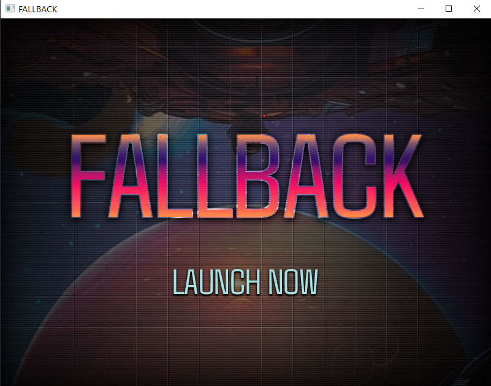
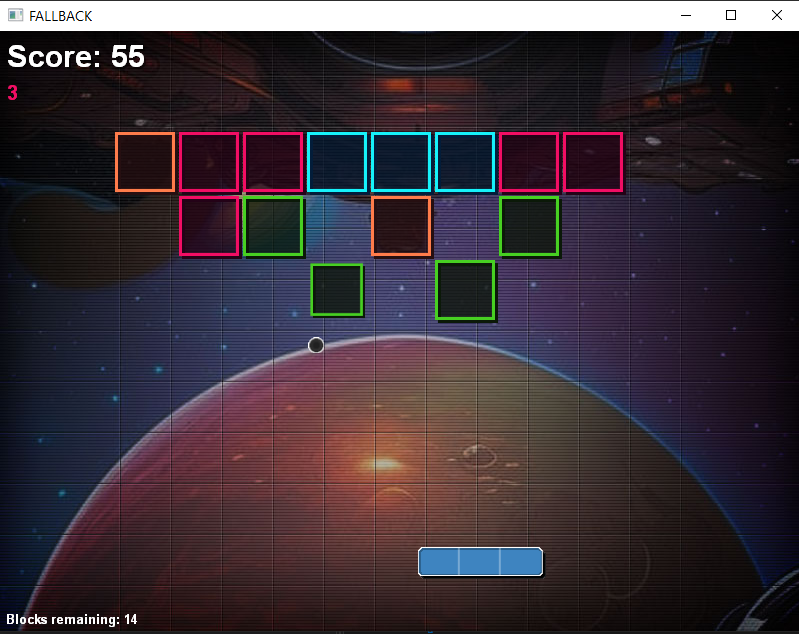
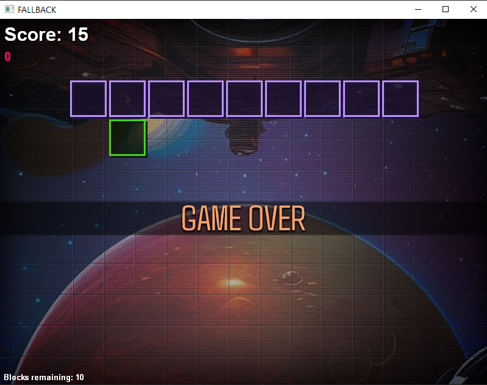

# Fallback

My first game in C++/DirectX!

## About the Original Project

Book: [Programming 2D Games by Charles Kelly](http://www.programming2dgames.com//)

Chapter 6 Challenge: Given the engine so far, make a game, any game. Keep it simple.

I chose to make a simple form of Breakout.

**Features**

* game loop (initialization, input, render, restart)
* collision detection
* game logic: ball resets if missed, blocks disappear when hit

## Learnings

I'll note that the content is quite old (from 2012) so I had to convert the code in the book and examples a bit to get it working on Windows 10. The biggest challenge was getting all the DirectX9 parts needed set up in the includes and linker settings.

* Learned the basics of Win32 (and WinRT) apps are set up and initialized
* Learned a ton about VS and how to work within it including the debugger
* Win32 apps don't have a built in log like other environments - the debugger is absolutely critical
* I have a very solid understanding of how all the pieces fit together in this engine and the things that need to be accounted for in any game engine
* I can see how the organization of the components so far will be a serious problem on a project that is much larger than this tiny game

## Proud Of

I'm proud of working through 2 blocking type bugs which stopped me in my tracks. But I kept at it and worked passed them. 

---

## Completion

I went back and updated this significantly beyond what the book covers into a complete little game. I'm very proud of implementing some of the things from other engines into this one. It was a blast!

### Final Features

- Title screen, game over (game state management), all with input controls/navigation to leave the game, start over, etc.
- Audio/SFX
- Animations/Tweening
- Added Block types which have varying health and associated colors with their remaining health. Blocks work down to a basic type but score as their original type which is worth more points
- Score tracking
- `Console` class and `log` display, including a common `toString` method which converts relevant object into into a displayable string
- Level progression and loading code
- UI Buttons with rollover states

